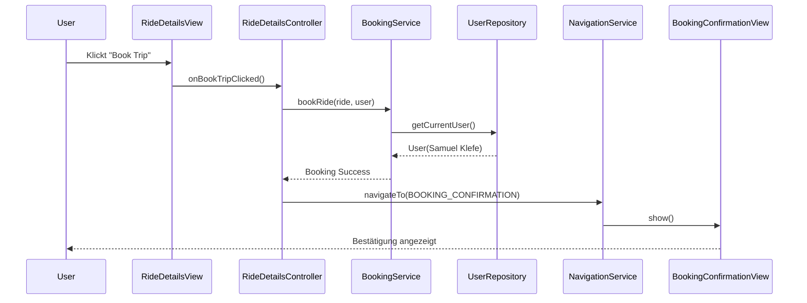
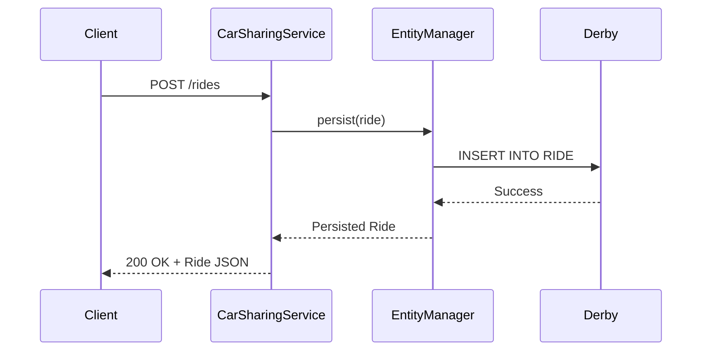
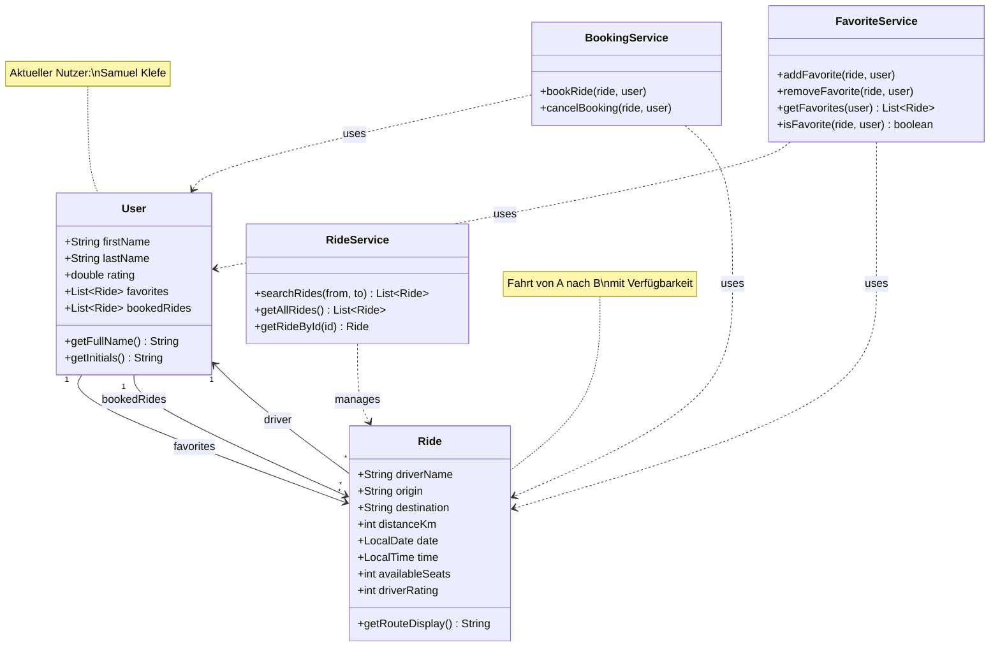
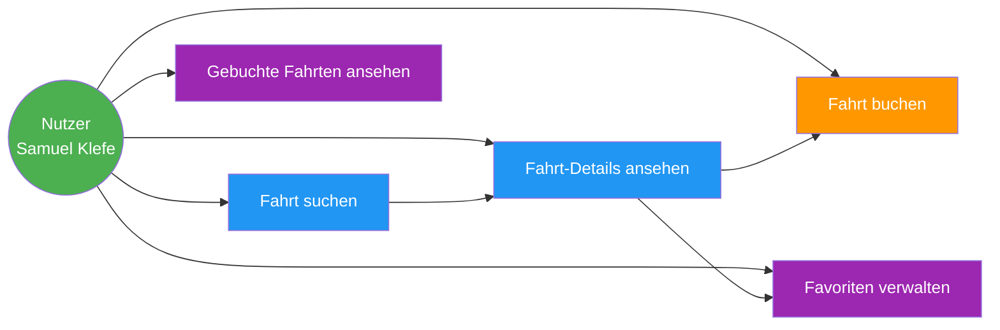
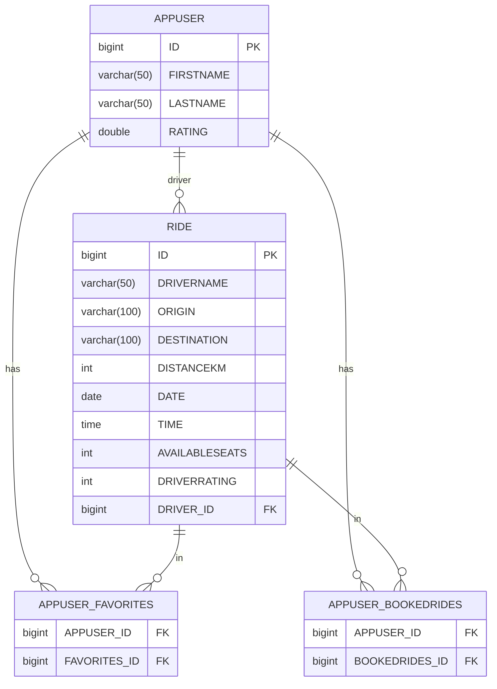
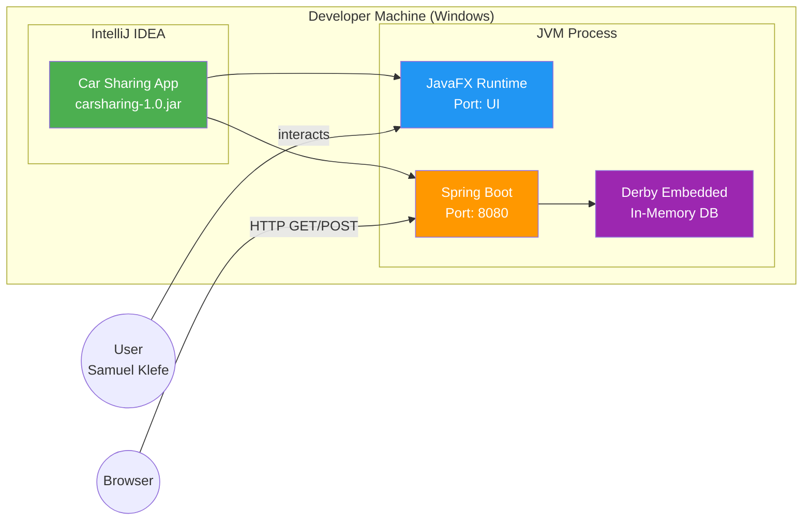

# 📐 Architecture & UML Diagrams - Car Sharing Application

## Übersicht

Diese Datei enthält alle 3 geforderten Diagramme:
1. **Function Architecture Diagram** - Systemarchitektur mit Schichten
2. **Conceptual UML Class Diagram** - Domänenmodell (vereinfacht)
3. **Technical UML Class Diagram** - Vollständiges technisches Klassendiagramm

---

## 1. Function Architecture Diagram

### System-Architektur: JavaFX Frontend + Spring Boot Backend

```mermaid
graph TB
    subgraph "Presentation Layer (JavaFX)"
        UI[UI Views<br/>FindRideView<br/>AvailableRidesView<br/>RideDetailsView<br/>FavoriteRidesView<br/>BookingConfirmationView]
        NAV[NavigationService<br/>View Routing]
        CTRL[Controllers<br/>FindRideController<br/>AvailableRidesController<br/>RideDetailsController<br/>FavoriteRidesController]
    end

    subgraph "Business Logic Layer (JavaFX)"
        SVC[Services<br/>RideService<br/>FavoriteService<br/>BookingService<br/>SessionService]
        REPO[Repositories In-Memory<br/>RideRepository<br/>UserRepository]
    end

    subgraph "Backend Layer (Spring Boot)"
        REST[REST Controller<br/>CarSharingService<br/>@RestController]
        CONFIG[Configuration<br/>AppConfig<br/>@Configuration]
    end

    subgraph "Persistence Layer"
        JPA[JPA Layer<br/>EntityManager<br/>EclipseLink]
        ENTITY[JPA Entities<br/>Ride @Entity<br/>User @Entity]
    end

    subgraph "Data Layer"
        DB[(Derby Database<br/>In-Memory<br/>APPUSER<br/>RIDE<br/>Join Tables)]
    end

    UI --> CTRL
    CTRL --> NAV
    CTRL --> SVC
    SVC --> REPO
    NAV --> UI

    REST --> CONFIG
    REST --> JPA
    JPA --> ENTITY
    ENTITY --> DB
    CONFIG --> JPA

    style UI fill:#e1f5ff
    style REST fill:#fff4e1
    style JPA fill:#e8f5e9
    style DB fill:#f3e5f5
```

### Datenfluss - Beispiel: Fahrt buchen



### Backend REST API Datenfluss



---

## 2. Conceptual UML Class Diagram

### Domänenmodell - Fachliche Konzepte



### Use Case Diagramm



---

## 3. Technical UML Class Diagram

### Vollständiges technisches Klassendiagramm mit allen Attributen und Methoden

```mermaid
classDiagram
    %% ========== MODEL LAYER ==========
    class User {
        <<Entity>>
        -long id
        -String firstName
        -String lastName
        -double rating
        -List~Ride~ favorites
        -List~Ride~ bookedRides
        +User()
        +User(id, firstName, lastName, rating)
        +getId() long
        +setId(long)
        +getFirstName() String
        +setFirstName(String)
        +getLastName() String
        +setLastName(String)
        +getRating() double
        +setRating(double)
        +getFavorites() List~Ride~
        +setFavorites(List~Ride~)
        +getBookedRides() List~Ride~
        +setBookedRides(List~Ride~)
        +getFullName() String
        +getInitials() String
        +toString() String
    }

    class Ride {
        <<Entity>>
        -long id
        -String driverName
        -String origin
        -String destination
        -int distanceKm
        -LocalDate date
        -LocalTime time
        -int availableSeats
        -int driverRating
        -User driver
        +Ride()
        +Ride(id, driverName, origin, destination, distanceKm, date, time, availableSeats, driverRating)
        +getId() long
        +setId(long)
        +getDriverName() String
        +setDriverName(String)
        +getOrigin() String
        +setOrigin(String)
        +getDestination() String
        +setDestination(String)
        +getDistanceKm() int
        +setDistanceKm(int)
        +getDate() LocalDate
        +setDate(LocalDate)
        +getTime() LocalTime
        +setTime(LocalTime)
        +getAvailableSeats() int
        +setAvailableSeats(int)
        +getDriverRating() int
        +setDriverRating(int)
        +getDriver() User
        +setDriver(User)
        +getRouteDisplay() String
        +toString() String
    }

    %% ========== REPOSITORY LAYER ==========
    class UserRepository {
        -List~User~ users
        +UserRepository()
        -initializeDummyData()
        +findAll() List~User~
        +findById(long) Optional~User~
        +getCurrentUser() User
        +save(User) User
        -getNextId() long
    }

    class RideRepository {
        -List~Ride~ rides
        +RideRepository()
        -initializeDummyData()
        +findAll() List~Ride~
        +findById(long) Optional~Ride~
        +searchRides(String, String) List~Ride~
        +save(Ride) Ride
        -getNextId() long
    }

    %% ========== SERVICE LAYER ==========
    class SessionService {
        -UserRepository userRepository
        +SessionService(UserRepository)
        +getCurrentUser() User
        +getUserInitials() String
    }

    class RideService {
        -RideRepository rideRepository
        +RideService(RideRepository)
        +searchRides(String, String) List~Ride~
        +getAllRides() List~Ride~
        +getRideById(long) Ride
    }

    class FavoriteService {
        -UserRepository userRepository
        -RideRepository rideRepository
        +FavoriteService(UserRepository, RideRepository)
        +addFavorite(long) boolean
        +removeFavorite(long) boolean
        +getFavorites() List~Ride~
        +isFavorite(long) boolean
    }

    class BookingService {
        -UserRepository userRepository
        +BookingService(UserRepository)
        +bookRide(Ride)
    }

    %% ========== CONTROLLER LAYER ==========
    class FindRideController {
        -RideService rideService
        -NavigationService navigationService
        +FindRideController(RideService, NavigationService)
        +onSearchClicked(String, String)
        +getUserInitials() String
    }

    class AvailableRidesController {
        -RideService rideService
        -FavoriteService favoriteService
        -NavigationService navigationService
        +AvailableRidesController(...)
        +getSearchResults() List~Ride~
        +onRideClicked(Ride)
        +onFavoriteClicked(long)
        +isFavorite(long) boolean
        +onBackClicked()
        +getUserInitials() String
    }

    class RideDetailsController {
        -Ride selectedRide
        -FavoriteService favoriteService
        -BookingService bookingService
        -NavigationService navigationService
        +RideDetailsController(...)
        +getRide() Ride
        +isFavorite() boolean
        +onFavoriteClicked()
        +onBookTripClicked()
        +onBackClicked()
        +getUserInitials() String
    }

    class FavoriteRidesController {
        -FavoriteService favoriteService
        -NavigationService navigationService
        +FavoriteRidesController(...)
        +getFavorites() List~Ride~
        +onRideClicked(Ride)
        +onBackClicked()
        +getUserInitials() String
    }

    %% ========== UI LAYER ==========
    class NavigationService {
        <<enum>> ViewType
        -Stage primaryStage
        -RideService rideService
        -FavoriteService favoriteService
        -BookingService bookingService
        -SessionService sessionService
        -ViewType previousView
        +NavigationService(...)
        +navigateTo(ViewType)
        +navigateTo(ViewType, Object)
        +back()
        +setPreviousView(ViewType)
        -createScene(ViewType, Object) Scene
        -getViewTitle(ViewType) String
    }

    class FindRideView {
        -BorderPane root
        -FindRideController controller
        +FindRideView(FindRideController)
        -buildUI()
        -createHeader() VBox
        -createContent() VBox
        -createBottomNavigation() HBox
        +getRoot() BorderPane
    }

    class AvailableRidesView {
        -BorderPane root
        -AvailableRidesController controller
        +AvailableRidesView(AvailableRidesController)
        -buildUI()
        -createHeader() VBox
        -createContent() VBox
        -createRideCard(Ride) VBox
        -createRatingStars(int) HBox
        -createBottomNavigation() HBox
        +getRoot() BorderPane
    }

    class RideDetailsView {
        -BorderPane root
        -RideDetailsController controller
        +RideDetailsView(RideDetailsController)
        -buildUI()
        -createHeader() VBox
        -createContent() VBox
        -createRatingStars(int) HBox
        -createBookButton() Button
        -createBottomNavigation() HBox
        +getRoot() BorderPane
    }

    class FavoriteRidesView {
        -BorderPane root
        -FavoriteRidesController controller
        +FavoriteRidesView(FavoriteRidesController)
        -buildUI()
        -createHeader() VBox
        -createContent() VBox
        -createRideCard(Ride) VBox
        -createRatingStars(int) HBox
        -createBottomNavigation() HBox
        +getRoot() BorderPane
    }

    class BookingConfirmationView {
        -BorderPane root
        -NavigationService navigationService
        -SessionService sessionService
        +BookingConfirmationView(NavigationService, SessionService)
        -buildUI()
        -createHeader() VBox
        -createContent() VBox
        -createBottomNavigation() HBox
        +getRoot() BorderPane
    }

    %% ========== BACKEND LAYER ==========
    class CarSharingService {
        <<RestController>>
        -EntityManager em
        +setup() String
        +getRide(long) Ride
        +getAllRides() List~Ride~
        +createRide(Ride) Ride
        +getUser(long) User
        +getAllUsers() List~User~
        +createUser(User) User
        +getBookedRides(long) List~Ride~
    }

    class AppConfig {
        <<Configuration>>
        +dataSourceProperties() DataSourceProperties
        +dataSource() DataSource
        +entityManagerFactory() LocalContainerEntityManagerFactoryBean
        +transactionManager(...) PlatformTransactionManager
    }

    class App {
        <<SpringBootApplication>>
        -ConfigurableApplicationContext springContext
        +init()
        +start(Stage)
        +stop()
        +main(String[])
    }

    %% ========== RELATIONSHIPS ==========
    %% Model
    User "1" --> "*" Ride : favorites
    User "1" --> "*" Ride : bookedRides
    Ride "*" --> "1" User : driver

    %% Repositories
    UserRepository --> User : manages
    RideRepository --> Ride : manages

    %% Services
    SessionService --> UserRepository
    RideService --> RideRepository
    FavoriteService --> UserRepository
    FavoriteService --> RideRepository
    BookingService --> UserRepository

    %% Controllers
    FindRideController --> RideService
    FindRideController --> NavigationService
    AvailableRidesController --> RideService
    AvailableRidesController --> FavoriteService
    AvailableRidesController --> NavigationService
    RideDetailsController --> FavoriteService
    RideDetailsController --> BookingService
    RideDetailsController --> NavigationService
    FavoriteRidesController --> FavoriteService
    FavoriteRidesController --> NavigationService

    %% UI Views
    FindRideView --> FindRideController
    AvailableRidesView --> AvailableRidesController
    RideDetailsView --> RideDetailsController
    FavoriteRidesView --> FavoriteRidesController
    BookingConfirmationView --> NavigationService
    BookingConfirmationView --> SessionService

    %% Navigation
    NavigationService --> RideService
    NavigationService --> FavoriteService
    NavigationService --> BookingService
    NavigationService --> SessionService

    %% Backend
    CarSharingService --> User : persists
    CarSharingService --> Ride : persists
    AppConfig ..> CarSharingService : configures
    App --> AppConfig : uses
    App --> NavigationService : creates
```



### Entity Relationship Diagram (Datenbank)



---

## 4. Component Diagram - System-Übersicht

```mermaid
graph TB
    subgraph "JavaFX Application (Client)"
        APP[App.java<br/>@SpringBootApplication<br/>extends Application]
        UI_LAYER[UI Layer<br/>5 Views]
        CTRL_LAYER[Controller Layer<br/>4 Controllers]
        SVC_LAYER[Service Layer<br/>4 Services]
        REPO_LAYER[Repository Layer<br/>2 In-Memory Repos]
        NAV[NavigationService]
    end

    subgraph "Spring Boot Backend (Server)"
        REST_API[REST Controller<br/>CarSharingService]
        CONFIG[AppConfig<br/>Spring Configuration]
        JPA_LAYER[JPA/EclipseLink]
    end

    subgraph "Data Layer"
        ENTITIES[JPA Entities<br/>User, Ride]
        DATABASE[(Derby DB<br/>In-Memory)]
    end

    APP --> UI_LAYER
    APP --> REST_API
    UI_LAYER --> CTRL_LAYER
    CTRL_LAYER --> SVC_LAYER
    CTRL_LAYER --> NAV
    SVC_LAYER --> REPO_LAYER
    NAV --> UI_LAYER

    REST_API --> CONFIG
    REST_API --> JPA_LAYER
    CONFIG --> JPA_LAYER
    JPA_LAYER --> ENTITIES
    ENTITIES --> DATABASE

    style APP fill:#4CAF50,color:#fff
    style REST_API fill:#FF9800,color:#fff
    style DATABASE fill:#2196F3,color:#fff
```

---

## 5. Deployment Diagram



---

## Verwendung der Diagramme

### Für Markdown/GitHub:
Diese Mermaid-Diagramme funktionieren direkt in:
- GitHub README.md
- GitLab README.md
- VS Code mit Mermaid Extension
- Online: mermaid.live

### Für PowerPoint/Word:
1. Besuchen Sie: https://mermaid.live
2. Kopieren Sie den Mermaid-Code
3. Exportieren Sie als PNG/SVG
4. Fügen Sie in Ihr Dokument ein

### Für LaTeX/Overleaf:
Nutzen Sie das `mermaid` Package oder exportieren Sie als PDF.

---

**Erstellt:** 2026-01-20  
**Projekt:** Car Sharing Application  
**Technologien:** JavaFX, Spring Boot, Derby, EclipseLink
